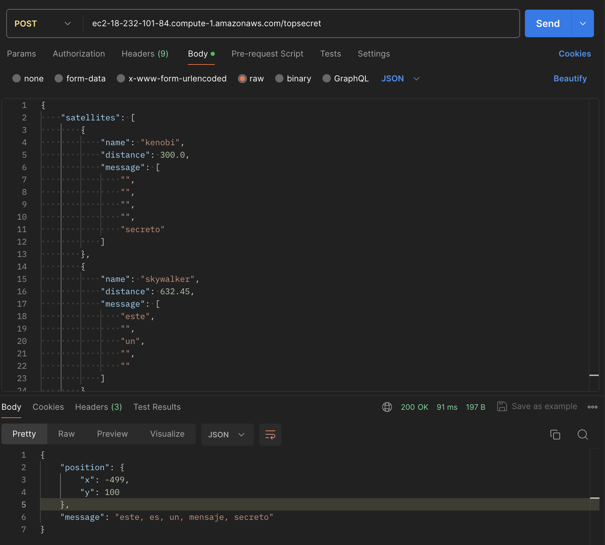

# Prueba Quasar

La solución propuesta fue desarrollada con Golang 1.22, Gin Framework, MariaDB y GORM. Se uso Clean Arquitecture con SOLID como base para su organización de directorios y desarrollo interno.

### Instrucciones de uso:

Como requisito se debe tener Golang 1.22, Compilador Makefile y Docker Compose. La base de datos esta pre-configurada, puede encontrarla como **quasar** y sus scripts de inicio en db/quasar.sql

Las configuraciónes de entorno anexadas como parte de la prueba y despliegue a servidor **producción** esta en el archivo .env, puede cambiar algunas variables para su ejecución local pero preferiblemente use despliegue local en Docker Compose.

###### Para inicializar la base de datos MariaDB
```shell
docker compose up -d mariadb
```

###### Prueba en desarrollo local: http://localhost:8080
```shell
# Inicio e instalación
make all
# o directo con go
go mod download

# Para mas ayuda con los scripts makefile ejecute
make help
```

###### Despliegue local servidor con Docker: http://localhost
```shell
# Automatizado con compilación multistage para la imagen golang
docker compose up --build mariadb app
```

### Solución:

###### Nivel 1 - Funciones
```shell
# GetLocation: con parametros para su ejecución
go run ./cmd location 300 632.45 1000
# o con make
make location arg="300 632.45 1000"
```
```shell
# GetMessage: con archivo json para su ejecución
go run ./cmd message "resources/example.json"
# o con make
make message arg="resources/example.json"
```
<p align="center">
  
</p>

###### Nivel 2 - POST /topsecret
<p align="center">
  
</p>

###### Nivel 3
POST /topsecret_split:name
<p align="center">
  
</p>
GET /topsecret_split
<p align="center">
  
</p>

### Ambiente en Nube:

###### URL Publica con AWS EC2, Ubuntu y Docker, despliegue productivo ejecutado con docker-compose.yml: 
Url: ec2-18-232-101-84.compute-1.amazonaws.com
